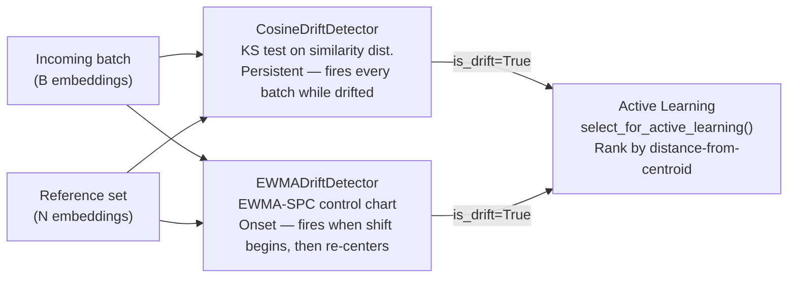

# Embedding Drift & Active Learning

**Pipeline:** `examples/pipelines/embedding_drift_active_learning/`  
**Config:** `configs/embedding_drift_active_learning.yaml`  
**P-level:** P0-04

## What it demonstrates

The most common cause of silent production CV failure in 2026 is not model bugs or infrastructure outages — it's **silent distribution shift**: the input data gradually diverges from the training distribution while the model keeps serving with no error signal. Latency looks fine, error rates are nominal, and accuracy decays invisibly.

This example builds the detection layer: two complementary drift detectors with different semantics, plus a label-free active-learning triage that prioritizes which shifted samples to label first.

## Two detectors, two semantics



**`CosineDriftDetector`** runs a Kolmogorov-Smirnov test between the distribution of cosine similarities to the reference centroid in the current batch vs. the reference set. It stays triggered for every batch where the distribution is shifted — right for monitoring dashboards that need a persistent "is the system healthy" signal.

**`EWMADriftDetector`** tracks an EWMA-smoothed centerline with a **frozen baseline standard deviation** (estimated from the pre-drift calibration period and never updated again). It fires at the onset of a shift, then re-centers as the EWMA mean adapts — right for alerting systems that need "something just changed."

!!! warning "Why frozen baseline?"
    A naive implementation that updates the baseline std from the incoming stream is self-defeating: the shift itself inflates the variance estimate and widens the control limits just when they need to stay tight. This was a real bug found during development — see `production_vlm.drift.EWMADriftDetector` docstring for the full explanation.

## Active learning triage

When either detector fires, `select_for_active_learning()` ranks the batch by distance from the reference centroid — samples farthest from the centroid are most likely to be genuinely novel and are queued for human labeling first. This is:

- **Free**: no labels needed, no extra model call
- **Principled**: distance-from-centroid is an effective proxy for novelty in practice (Settles, 2009)
- **Honest**: it's a proxy, not a guaranteed ranking — documented as such

## Run it

```bash
production-vlm run-example embedding_drift_active_learning
```

```
Drift detected at batch 6 (true shift started at batch 6, detection delay = 0 batches)
Active learning queue accumulated 30 samples flagged for labeling / retraining
```

## Sensitivity sweep

```bash
production-vlm benchmark embedding_drift_active_learning
```

Sweeps the injected shift magnitude from subtle (magnitude 1.0) to obvious (magnitude 18.0) and reports detection delay at each level. At low magnitudes the detector correctly fails to trigger — this is the honest sensitivity/specificity tradeoff, not hidden.

## Swapping in a real encoder

```python
from production_vlm.utils.vision_encoder import RealVisionEncoder

encoder = RealVisionEncoder("facebook/dinov2-base")  # or SigLIP-2, CLIP
embeddings = encoder.encode(list_of_pil_images)
```

The rest of the drift-detection and active-learning code is unchanged. Requires `pip install -e ".[ml]"`.
