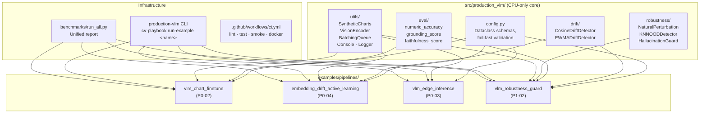

# Architecture

## Overview

The repo has two layers: a shared library (`src/production_vlm/`) with no hard ML dependencies, and four example pipelines that import from it. Every example has the same structural contract — a `main(config_path=None)` entry point, a YAML config with pinned checkpoint dates, and a `results.json` output — so the benchmark runner can collect and compare them without example-specific logic.



## Shared library (`src/production_vlm/`)

The shared library has five submodules, each independently importable and testable without any ML framework:

**`production_vlm.config`** — Stdlib dataclass schemas for experiment configs with `__post_init__` validation. No pydantic required; fast-fails with a clear `ConfigError` rather than an opaque exception deep inside a training loop.

**`production_vlm.drift`** — Two complementary drift detectors:

- `CosineDriftDetector`: two-sample KS test on cosine-similarity distributions (batch-level, persistent)
- `EWMADriftDetector`: EWMA-centerline SPC with a *frozen baseline standard deviation* (online, onset-detecting)

The frozen baseline was a real design fix — a continuously-adapting variance estimate is self-defeating under a step-change because the shift itself inflates the estimate and widens the control limits.

**`production_vlm.eval`** — Three metrics for chart/document VQA where standard text metrics (exact-match, BLEU) give misleading signal:

- `numeric_accuracy`: extracts and compares numeric tokens with relative tolerance
- `grounding_score`: checks content words in the answer against the source evidence
- `faithfulness_score`: weighted combination, inspired by RAGAS adapted for image evidence

**`production_vlm.robustness`** — Three components (see [OOD & Robustness](../concepts/robustness.md)):

- `NaturalPerturbation`: six ImageNet-C-style perturbation functions
- `KNNOODDetector`: per-sample kNN cosine-similarity OOD detection, threshold calibrated from the reference set's own leave-one-out similarities
- `HallucinationGuard`: pass/flag/reject policy on top of `faithfulness_score`

**`production_vlm.utils`** — Shared utilities: synthetic chart generator, vision encoder abstraction (proxy + real), dynamic batching queue, adaptive console, run logger.

## Example pipelines

Each example follows the same contract:

```
examples/pipelines/<name>/
├── __init__.py
├── README.md          # per-example docs
└── run.py             # main(config_path=None) → dict
```

The `main()` function:

1. Loads and validates its YAML config (via `ExperimentConfig.from_dict` or plain `yaml.safe_load`)
2. Detects whether the real ML stack (torch/transformers/onnx) is available
3. Runs either the real path or the clearly-labeled CPU fallback
4. Writes `outputs/<name>/results.json` with a `ran_with_real_ml_stack` flag
5. Returns the results dict so the benchmark runner can collect without re-parsing JSON

## CPU/GPU fallback contract

Every example that depends on an ML library guards the import with a runtime check:

```python
def _has_real_ml_stack() -> bool:
    try:
        import torch, transformers, peft
    except ImportError:
        return False
    return torch.cuda.is_available()
```

The fallback path always runs real code for everything except the model forward/backward pass itself (which is simulated or proxied). This means:

- Data generation: real
- Config validation: real
- Evaluation metric computation: real
- Timing harness: real (on a compute-equivalent proxy)
- Model weights: not loaded

This design was not theoretical — it came from actually running the repo in an offline sandbox with no network and no GPU during development, and finding that every alternative (fail loudly, skip silently, stub everything) was worse for trust than this approach.
